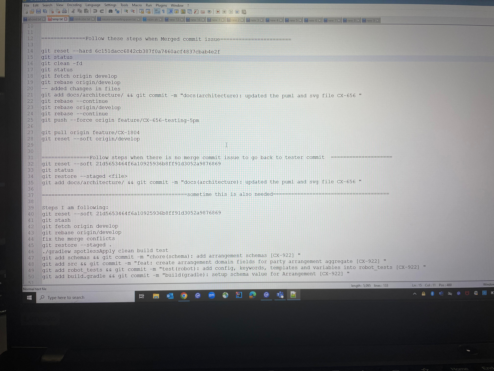

# Important Git commands which you should know in industry

# The below commands we use when there is merge commit present in your commit history.

**Follow these steps when merge commit issue**

**1. Move to the previous commit on which you want to add your code for good commit history**

```shell
This is the commit id for tester on the top of that I need to add my code.

```
```shell
1. git reset --hard previous-commit-id
2. git status

```
**2. Clean all the not-required files for instance .idea folder using command**
```shell
git clean -fd

```

**3. Now fetch the develop branch and rebase it with the commit id which we have mentioned in step1**

```shell
git fetch origin develop
git rebase origin/develop

```

**4. Now added your changes that you want to add with good commit history**
```shell
git add docs && git commit -m "docs(architecture): updated the puml file CX-656"

```

**5. Forcefully push the changes**
```shell
git push --force origin fature/CX-656

```

# Follow these steps when there is no merge commit present, but you want to maintain the good commit history

**1. Move to the previous commit on which you want to add your code for good commit history**

```shell
This is the commit id for tester on the top of that I need to add my code.

```
```shell
1. git reset --soft previous-commit-id
2. git status
3. git restore --staged .
4. git add docs && git commit -m "docs(architecture): updated the puml file CX-656"

```


**6. Here is the screenshot of the commands which I am using currently.**





