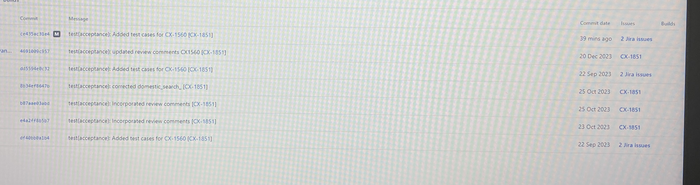

# Important Git commands which you should know in industry

# The below commands we use when there is merge commit present in your commit history.

**Follow these steps when merge commit issue**

```shell
1. Move to the previous commit on which you want to add your code for good commit history.
2. This is the commit id for tester on the top of that I need to add my code.
3. Clean all the not-required files for instance .idea folder using command.
4. Now fetch the develop branch and rebase it with the commit id which we have mentioned in step1.
5. Now added your changes that you want to add with good commit history.
6. Forcefully push the changes

```


**Commands regarding above**
```shell
1. git reset --hard previous-commit-id
2. git status
3. git clean -fd
4. git fetch origin develop
5. git rebase origin/develop
6. git add docs && git commit -m "docs(architecture): updated the puml file CX-656"
7. git push --force origin fature/CX-656

```

# Follow these steps when there is no merge commit present, but you want to maintain the good commit history

**1. Move to the previous commit on which you want to add your code for good commit history**

```shell
This is the commit id for tester on the top of that I need to add my code.

```
```shell
1. git reset --soft previous-commit-id
2. git status
3. git restore --staged .
4. git add docs && git commit -m "docs(architecture): updated the puml file CX-656"
5. git push -f

```
**Sometimes when you move your code to previous commit for instance tester commit, in that scenario all the changes you will see that is**
**merged in your dev branch including the changes you have done in your branch, but you need only changes that are being done by you**
**in this case, we follow below-mentioned steps: Also see the image attached at the end.**

```shell
1. git reset --soft previous-commit-id
2. git stash
3. git fetch origin develop
4. git rebase origin/develop
5. fix the merge conflicts
6. git restore --staged .
7. git add docs && git commit -m "docs(architecture): updated the puml file CX-656"
8. git push -f
```


**6. Here is the screenshot of the commands which I am using currently.**


